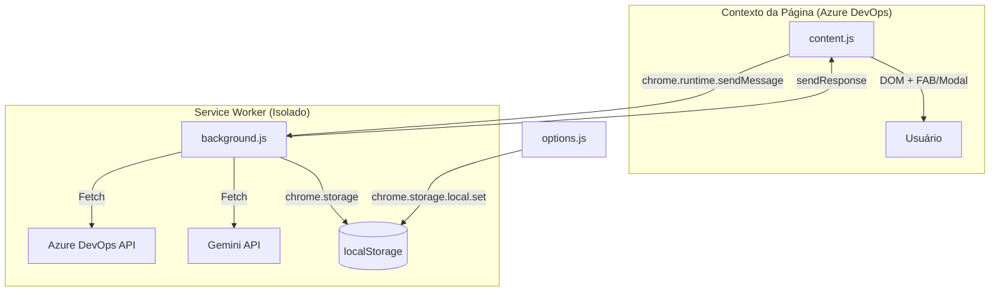
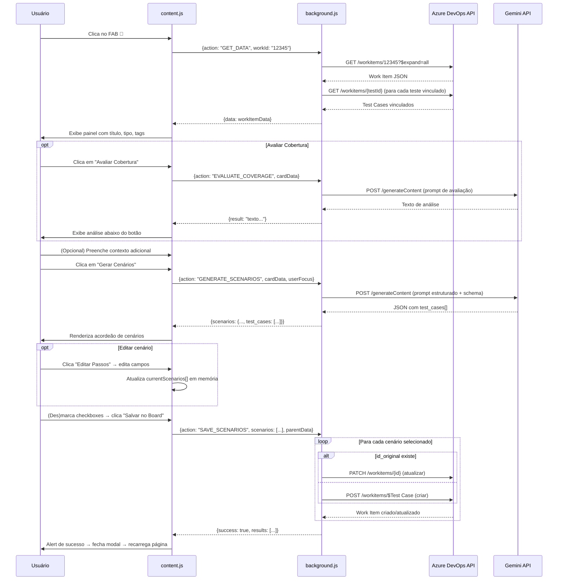

# QualiFlow - Fluxo do Gerador de CTs (canonica)

Ultima atualizacao: 2026-08-19

Esta secao e a referencia oficial do fluxo de geracao de CTs. O restante do documento pode conter historico arquitetural e informacoes auxiliares.

## 1. Escopo do fluxo do gerador

O fluxo do gerador cobre estas features:

1. Carregamento de contexto do card alvo.
2. Avaliacao de cobertura existente.
3. Geracao de cenarios com IA e RTM.
4. Revisao/edicao manual de cenarios.
5. Parametrizacao por tokens @campo.
6. Salvar localmente e retomar sessao.
7. Reaproveitar CTs de outro card (copia manual).
8. Ajustes automaticos por IA em CTs copiados.
9. Exibicao de RTM apos ajuste automatico.
10. Salvar cenarios finais no board.

## 2. Entradas, estado e actions

### 2.1 Entradas da tela

1. Objetivo do cenario.
2. Tipo de validacao.
3. Estilo dos passos.
4. Nivel de dados.
5. Detalhamento tecnico (opcional).
6. Foco especifico (opcional).
7. Criterios de aceite (editaveis).

### 2.2 Estado principal da UI

1. currentWorkItemData.
2. currentScenarios.
3. currentCoverageData.
4. currentCopyContext.

Interpretacao de currentCopyContext:

1. null: fluxo normal.
2. mode = manual: cenarios copiados sem RTM.
3. mode = adapted: cenarios ajustados por IA com RTM.

### 2.3 Actions de runtime do gerador

1. GET_DATA.
2. EVALUATE_COVERAGE.
3. GENERATE_SCENARIOS.
4. ADAPT_COPIED_SCENARIOS.
5. SAVE_SCENARIOS.
6. GET_TEST_RUNNER_CARDS (lista cards fonte para copia).
7. GET_TEST_CASES_FOR_WORKITEM (carrega CTs do card fonte).

## 3. Fluxo principal: Gerar Cenarios

1. QA abre um card no Azure e abre o modal do QualiFlow.
2. UI chama GET_DATA para carregar titulo, descricao, tags e criterios.
3. QA ajusta os campos de configuracao e clica em Gerar Cenarios.
4. UI envia GENERATE_SCENARIOS.
5. Background executa pipeline orquestrado:
  1. decomposicao
  2. geracao em lotes
  3. RTM
  4. pos-processamento local
6. UI recebe cenarios e renderiza lista + matriz RTM.
7. QA edita cenarios, passos e parametros.
8. QA salva localmente (opcional) ou salva no board.

## 4. Fluxo de copia de CTs de outro card

### 4.1 Modo 1: copia manual (sem RTM)

1. QA clica em Reaproveitar CTs de Outro Card.
2. UI abre lista pesquisavel de cards fonte com CTs.
3. QA seleciona um card fonte.
4. UI carrega os CTs desse card e os converte para cenarios editaveis.
5. QA entra no fluxo padrao de revisao/edicao.
6. RTM fica oculto neste modo por design.
7. Botao Ajustes Automaticos fica visivel para o proximo passo opcional.

### 4.2 Modo 2: ajuste automatico por IA (com RTM)

1. Pre-condicao: cenarios copiados no modo manual.
2. QA clica em Ajustes Automaticos.
3. UI envia ADAPT_COPIED_SCENARIOS com:
  1. card alvo
  2. cenarios copiados
  3. copyContext
  4. configuracoes de geracao
  5. foco e detalhe tecnico
4. Background executa orchestrateScenarioAdaptation.
5. IA adapta os CTs copiados ao contexto do card alvo.
6. RTM e recalculado para comprovar cobertura dos criterios do card alvo.
7. UI volta ao fluxo de revisao com RTM visivel.

## 5. Revisao, edicao e qualidade dos cenarios

No modal de edicao por cenario:

1. editar titulo.
2. editar contexto BDD.
3. editar steps acao/esperado.
4. marcar needs_evidence por passo.
5. reordenar passos por drag-and-drop.
6. preencher parametros @campo detectados.
7. definir responsavel opcional.

Regras de consistencia no fluxo:

1. parametros faltantes recebem ###.
2. saida passa por pos-processamento antes de render.
3. save envia apenas cenarios selecionados e valida formato de assignedTo.

## 6. Persistencia local

Chave: qualiflowSavedSessions.

Payload salvo:

1. workItem.
2. scenariosData.
3. coverageData.
4. copyContext.
5. timestamp.

Uso:

1. continuar edicao depois sem perder alteracoes.
2. retomar fluxo de copia/ajuste com estado preservado.

## 7. Salvar no board

1. QA marca cenarios desejados.
2. UI chama SAVE_SCENARIOS.
3. background cria Test Cases no board.
4. tags do card pai sao herdadas.
5. sessao local do work item e removida em sucesso total.
6. em sucesso parcial, UI mostra detalhe de falhas por cenario.

## 8. Arquivos-chave do fluxo

1. apps/extension/src/content/ui.js.
2. apps/extension/src/content/scenarios.js.
3. apps/extension/src/content/state.js.
4. apps/extension/src/content/utils.js.
5. apps/extension/src/services/background.js.
6. apps/extension/src/services/orchestration/testGeneration.js.
7. apps/extension/src/services/orchestration/postProcessor.js.

---

## 9. Arquitetura atual (modular)

A arquitetura nao e mais monolitica em um unico content script. Hoje ela esta separada por responsabilidade.

### 2.1 Estrutura principal da extensao

- apps/extension/manifest.json
- apps/extension/src/content/
  - state.js
  - utils.js
  - ui.js
  - dashboard.js
  - scenarios.js
  - main.js
  - runner.js
- apps/extension/src/services/
  - background.js
  - azureService.js
  - geminiService.js
  - copilotService.js
  - groqService.js
  - scenarioPostProcessor.js
  - testGenerationOrchestrator.js
- apps/extension/src/pages/options/
  - options.html
  - options.js
- apps/extension/src/styles/
  - content.css
  - options.css

### 2.2 Manifest e injecoes

Arquivo: apps/extension/manifest.json

- manifest_version: 3
- background service worker em modulo: src/services/background.js

Content scripts configurados:

1. Contexto Azure DevOps
- Matches: dev.azure.com e *.visualstudio.com
- JS: state.js, utils.js, ui.js, dashboard.js, scenarios.js, main.js
- CSS: src/styles/content.css

2. Contexto universal para runner
- Matches: <all_urls>
- JS: src/content/runner.js
- CSS: src/styles/content.css

Observacao importante:
- runner.js se auto-desativa quando detecta host do Azure DevOps.
- Em paginas alvo, ele so aparece se a URL atual corresponder a algum projeto configurado em runnerProjects.

---

## 3. Fluxo funcional por tela

### 3.1 FAB e modal lateral (Azure)

Implementado em src/content/ui.js.

Botoes do FAB:

1. Dashboard QA
2. Gerador de cenarios
3. Runner (agora em pagina lateral do mesmo modal, sem popup flutuante no Azure)
4. Configuracoes

Aberturas no modal:

1. Pagina generator
2. Pagina dashboard
3. Pagina runner (lista de cards com testes + escolha de alvo)
4. Pagina settings

### 3.2 Gerador de cenarios

Implementado em src/content/scenarios.js + background/service layer.

Entradas de geracao:

- Contexto do Work Item atual.
- Criterios de aceite editaveis.
- Foco do usuario.
- Detalhamento tecnico.
- Configs de geracao:
  - objetivo
  - tipo
  - granularidade
  - nivel de dados

Progresso visual em fases:

1. analyzing
2. batch
3. rtm
4. postprocess
5. done/error

A extensao escuta mensagens de progresso do background via action GENERATION_PROGRESS.

Saida exibida:

- Lista de cenarios editaveis.
- RTM (matriz de rastreabilidade).
- Score/cobertura/insights.

Persistencia local:

- Salvar revisao local em qualiflowSavedSessions.
- Retomar sessao local depois.

### 3.3 Dashboard QA

Implementado em src/content/dashboard.js.

Capacidades atuais:

1. Listagem de cards por tag QA.
2. Filtros por iteration/sprint.
3. Atualizacao de estado de Work Items.
4. Aba de validacao de deploy:
  - iteracoes
  - consolidacao de informacoes
  - visoes e exportacoes (texto/html)

### 3.4 Runner no Azure (pagina lateral)

Implementado em src/content/ui.js.

Objetivo:

- Encontrar cards com testes.
- Filtrar cards.
- Selecionar projeto/URL alvo para execucao.
- Criar sessao ativa no storage e abrir pagina alvo em nova aba.

Sessao salva:

- runnerActiveSession com workItemId, titulo, tipo, projeto alvo, targetUrl e timestamp.

### 3.5 Runner na pagina alvo (janela flutuante)

Implementado em src/content/runner.js.

Capacidades atuais:

1. Detecta sessao ativa e carrega CTs vinculados ao PBI.
2. Cria Test Run real no Azure.
3. Suporta pontos de teste e modo ad-hoc.
4. Permite marcar passos pass/fail, comentario e outcome geral.
5. Cria bug a partir de falha de passo.
6. Anexa evidencias (screenshot/gravacao) por CT e por passo.
7. Finaliza o Test Run.

Novidade recente:

- Janela minimizavel.
- Ao minimizar, vira bolinha flutuante arrastavel.
- Clique na bolinha restaura a janela.

---

## 4. Service Worker (orquestrador central)

Arquivo: apps/extension/src/services/background.js

E o ponto unico para:

1. Ler configuracoes do storage.
2. Receber mensagens dos content scripts.
3. Chamar Azure/IA/backend Copilot.
4. Devolver respostas para UI.

### 4.1 Acoes de mensagem suportadas

Dados Azure/UI:

1. GET_DATA
2. GET_DASHBOARD_DATA
3. GET_PROJECT_ITERATIONS
4. GET_DEPLOY_VALIDATION
5. UPDATE_WORK_ITEMS_STATE

Runner:

1. GET_TEST_RUNNER_CARDS
2. GET_TEST_CASES_FOR_WORKITEM
3. GET_TEST_POINTS_FOR_TEST_CASES
4. CREATE_TEST_RUN
5. GET_RUN_RESULTS
6. ADD_ADHOC_RESULTS
7. UPDATE_TEST_RESULT
8. COMPLETE_TEST_RUN
9. CREATE_BUG
10. ADD_ATTACHMENT
11. CAPTURE_SCREENSHOT

IA:

1. GENERATE_SCENARIOS
2. EVALUATE_COVERAGE
3. GET_GEMINI_MODELS
4. GET_COPILOT_MODELS
5. GET_GROQ_MODELS

Copilot OAuth:

1. COPILOT_AUTH_START
2. COPILOT_AUTH_POLL

### 4.2 Roteamento de IA

O selectedAi define o provider:

1. gemini -> geminiService
2. copilot -> copilotService (via backend)
3. groq -> groqService

Na geracao:

1. Tenta fluxo orquestrado em testGenerationOrchestrator.
2. Em erro, cai para fallback legado de geracao direta por provider.
3. Resultado final passa por scenarioPostProcessor para consolidacao.

---

## 5. Integracoes externas

### 5.1 Azure DevOps

Implementacao principal em apps/extension/src/services/azureService.js.

Usos principais:

1. Leitura de Work Item, relacoes e testes existentes.
2. Criacao de Test Case com passos estruturados.
3. Dashboard QA e filtros.
4. Runner (cards, test points, runs, resultados, bugs, anexos).
5. Validacao de deploy por iteracao.

Campos de configuracao necessarios:

1. azurePat
2. azureOrg
3. azureProject

### 5.2 Gemini

Implementacao em apps/extension/src/services/geminiService.js.

- Gera cenarios em JSON estruturado.
- Avalia cobertura.
- Busca modelos disponiveis via API de models.

### 5.3 GitHub Copilot (via backend)

Implementacao em apps/extension/src/services/copilotService.js + backend Node.

Fluxo:

1. Extensao inicia login OAuth com COPILOT_AUTH_START.
2. Backend abre aba de login GitHub.
3. Extensao faz polling com COPILOT_AUTH_POLL.
4. sessionToken e salvo no storage local da extensao.
5. Requisicoes de geracao/avaliacao usam backend autenticado.

URL backend padrao atualmente:

- https://qualiflow-gerador-de-cts.onrender.com

### 5.4 Groq

Implementacoes em:

- apps/extension/src/services/groqService.js

Suporta:

1. Geracao de cenarios
2. Avaliacao de cobertura
3. Lista de modelos

---

## 6. Configuracoes e armazenamento local

### 6.1 Chaves principais no chrome.storage.local

Gerais:

1. qaEmail
2. qaTag
3. selectedBoard
4. selectedAi

Azure:

1. azurePat
2. azureOrg
3. azureProject

Gemini:

1. geminiKey
2. geminiModel

Copilot:

1. copilotToken
2. copilotSessionToken
3. copilotBackendUrl
4. copilotModel

Groq:

1. groqKey
2. groqModel

Runner:

1. runnerProjects
2. runnerEnabled
3. runnerActiveSession

Sessoes locais de revisao:

1. qualiflowSavedSessions

### 6.2 Telas de configuracao

A extensao possui duas UIs de configuracao:

1. Popup/options page:
- apps/extension/src/pages/options/options.html
- apps/extension/src/pages/options/options.js

2. Tela de configuracoes dentro do modal lateral (Azure):
- apps/extension/src/content/ui.js

A tela interna do modal e a mais completa para o fluxo em pagina Azure.

---

## 7. Backend Copilot de apoio

Pasta: apps/api/

Stack:

1. Node 22
2. Express
3. @github/copilot-sdk

Endpoints relevantes:

1. GET /health
2. GET /metrics/runtime
3. GET /metrics/report
4. POST /metrics/reset
5. GET /auth/status
6. POST /auth/session/start
7. GET /auth/session/poll/:requestId
8. GET /auth/github/login
9. GET /auth/github/callback
10. GET /auth/me
11. POST /auth/logout
12. GET /api/copilot/models
13. POST /api/copilot/generate
14. POST /api/copilot/evaluate
15. POST /api/copilot/test

Metrica de requisicoes:

- Latencia (avg, p50, p95), status codes, pico de concorrencia, erros por codigo.

---

## 8. Instalacao e uso (estado atual)

### 8.1 Carregar extensao localmente

1. Abrir chrome://extensions.
2. Ativar modo desenvolvedor.
3. Clicar em Carregar sem compactacao.
4. Selecionar a pasta extension.

### 8.2 Configuracao minima para rodar no Azure

1. Preencher Azure PAT, Organization URL e Project Name.
2. Selecionar o provider de IA.
3. Informar credenciais da IA escolhida:
- Gemini key
- ou OAuth Copilot
- ou Groq key
- ou Groq key
4. Salvar configuracoes.

### 8.3 Fluxo basico de geracao

1. Abrir um Work Item no Azure Boards.
2. Clicar no FAB do QualiFlow.
3. Abrir Gerador.
4. Ajustar parametros e gerar.
5. Revisar/editar.
6. Salvar no board.

### 8.4 Fluxo basico de runner

No Azure:

1. Abrir Runner (pagina lateral no modal).
2. Escolher card e projeto alvo.
3. Abrir URL alvo.

Na pagina alvo:

1. Abrir janela do runner pelo FAB.
2. Executar CTs e registrar resultados.
3. Anexar evidencias.
4. Finalizar run.

---

## 9. Observacoes tecnicas importantes

1. O runner global injeta em all_urls, mas so exibe UI quando a URL bate com runnerProjects e nao for host Azure.
2. O modal no Azure usa navegacao lateral interna e agora inclui a pagina runner (sem popup separado no Azure).
3. A janela do runner na pagina alvo suporta minimizar em bolinha arrastavel e restaurar por clique.
4. O backend Copilot e obrigatorio para selectedAi=copilot.
5. O post-processamento local de cenarios e parte do fluxo oficial e garante consistencia minima antes da revisao.

---

## 10. Limitacoes conhecidas e pontos de atencao

1. Existem duas implementacoes de UI de configuracao (popup/options e modal in-page), o que aumenta risco de divergencia funcional.
2. O board efetivamente suportado hoje e Azure DevOps; Jira/Asana aparecem como placeholders.
3. Segredos (PAT e API keys) ficam em chrome.storage.local; para ambientes corporativos, considerar politicas adicionais de endpoint/seguranca.

---

## 11. Referencia rapida de arquivos-chave

Core da extensao:

1. apps/extension/manifest.json
2. apps/extension/src/services/background.js
3. apps/extension/src/services/azureService.js
4. apps/extension/src/content/ui.js
5. apps/extension/src/content/scenarios.js
6. apps/extension/src/content/dashboard.js
7. apps/extension/src/content/runner.js

Configuracoes:

1. apps/extension/src/pages/options/options.html
2. apps/extension/src/pages/options/options.js

Backend Copilot:

1. apps/api/src/server.js
2. apps/api/src/authRoutes.js
3. apps/api/src/copilotService.js

---

Ultima atualizacao desta documentacao: 2026-08-08# QualiFlow — Gerador de Casos de Teste: Documentação Completa

> Extensão de navegador (Chrome/Edge) para gerar e salvar Casos de Teste BDD diretamente no Azure DevOps Boards, utilizando a API Gemini do Google como motor de geração de cenários.

---

## Índice

1. [Visão Geral](#visão-geral)
2. [Arquitetura e Estrutura de Arquivos](#arquitetura-e-estrutura-de-arquivos)
3. [Manifesto — `manifest.json`](#manifesto--manifestjson)
4. [Service Worker — `background.js`](#service-worker--backgroundjs)
5. [Content Script — `content.js`](#content-script--contentjs)
6. [Página de Configurações — `options.html` / `options.js`](#página-de-configurações--optionshtml--optionsjs)
7. [Estilos — `content.css` / `options.css`](#estilos--contentcss--optionscss)
8. [Fluxo de Dados Completo](#fluxo-de-dados-completo)
9. [Sistema de Mensagens (Message Passing)](#sistema-de-mensagens-message-passing)
10. [Integração com Azure DevOps](#integração-com-azure-devops)
11. [Integração com Gemini AI](#integração-com-gemini-ai)
12. [Estrutura de Dados dos Cenários](#estrutura-de-dados-dos-cenários)
13. [Lógica da Interface do Usuário](#lógica-da-interface-do-usuário)
14. [Instalação e Configuração](#instalação-e-configuração)

---

## Visão Geral

O **QualiFlow** é uma extensão Manifest V3 que se injeta em páginas do Azure DevOps. Seu objetivo é automatizar o ciclo de geração de Casos de Teste BDD: dado um Work Item (PBI/História) aberto no board, o QualiFlow busca seus dados, chama o Gemini para gerar cenários estruturados, exibe uma interface de revisão e, após aprovação do QA, persiste os testes diretamente no Azure DevOps como Work Items do tipo *Test Case*.

**Tecnologias:**

- **Manifest Version:** 3 (MV3)
- **IA:** Google Gemini (via REST API)
- **Integração:** Azure DevOps REST API v7.1
- **Formato de Saída:** BDD (Gherkin em pt-BR) + XML de passos para o Azure TCM

---

## Arquitetura e Estrutura de Arquivos

```
apps/extension/
├── manifest.json      — Configurações, permissões e ponto de entrada
├── background.js      — Service Worker: toda a lógica de API (Azure + Gemini)
├── content.js         — Injetado na página: UI (FAB, Modal) e orquestração
├── content.css        — Estilos da UI injetada na página do Azure DevOps
├── options.html       — Página de configurações (popup e options_page)
├── options.js         — Lógica de salvar/restaurar configurações
└── options.css        — Estilos da página de configurações
```



---

## Manifesto — `manifest.json`

O manifesto é o arquivo de configuração central da extensão, declarando identidade, permissões e pontos de entrada.

### Permissões

| Permissão | Finalidade |
|---|---|
| `storage` | Salvar/recuperar credenciais (PAT, API Key, etc.) via `chrome.storage.local` |
| `activeTab` | Acessar a aba ativa para injeção de scripts |
| `scripting` | Injetar scripts e estilos dinamicamente |

### Host Permissions (Acesso a domínios externos)

| Padrão | Finalidade |
|---|---|
| `*://dev.azure.com/*` | Acesso às APIs do Azure DevOps e injeção de content scripts |
| `*://*.visualstudio.com/*` | Suporte a organizações no domínio legado do Azure |
| `*://generativelanguage.googleapis.com/*` | Chamadas à API do Gemini (feitas do background, exige host_permission) |

### Pontos de Entrada

| Campo | Valor | Descrição |
|---|---|---|
| `background.service_worker` | `background.js` | Registra o Service Worker persistente |
| `content_scripts[].js` | `content.js` | Script injetado em todas as páginas do Azure DevOps |
| `content_scripts[].css` | `content.css` | Estilos injetados junto ao content script |
| `options_page` | `options.html` | Página de configurações acessível via `chrome://extensions` |
| `action.default_popup` | `options.html` | A mesma página de configurações aparece como popup do ícone da extensão |

---

## Service Worker — `background.js`

O `background.js` é o "back-end" da extensão. Rodando em um contexto isolado como Service Worker MV3, ele é responsável por **todas as chamadas de rede** (fetch), pois o Content Script sofre restrições de CORS. Ele se comunica com o `content.js` exclusivamente via mensagens (`chrome.runtime.onMessage`).

### Função `getSettings()`

```javascript
async function getSettings()
```

Recupera de forma assíncrona todas as configurações salvas no `chrome.storage.local`:

- `azurePat` — Personal Access Token do Azure DevOps
- `azureOrg` — URL base da organização (ex: `https://dev.azure.com/MinhaOrg`)
- `azureProject` — Nome do projeto Azure
- `geminiKey` — Chave da API do Google Gemini
- `geminiModel` — Identificador do modelo Gemini (ex: `gemini-2.5-flash`)

Retorna uma `Promise` que resolve com um objeto contendo todos esses campos.

---

### Módulo Azure DevOps API

#### `azureGetWorkItem(id, settings)`

Busca os dados completos de um Work Item pelo seu ID numérico.

**Fluxo:**

1. Constrói a URL: `{org}/{project}/_apis/wit/workitems/{id}?$expand=all&api-version=7.1`
2. Autentica via **Basic Auth** com o PAT: `Authorization: Basic base64(":PAT")`
3. Itera sobre `workItem.relations` buscando relações do tipo `TestedBy` ou `Tests`
4. Para cada relação encontrada, faz uma requisição adicional para buscar os dados do Test Case vinculado (título, descrição Gherkin, passos em XML)
5. Retorna um objeto normalizado com as propriedades relevantes do Work Item

**Objeto retornado:**

```javascript
{
    id, url, title, description,
    acceptance_criteria,  // Microsoft.VSTS.Common.AcceptanceCriteria
    type,                 // System.WorkItemType
    tags,                 // System.Tags
    areaPath,            // System.AreaPath
    iterationPath,       // System.IterationPath (Sprint)
    existing_tests: [{ id, title, description, xmlStepsRaw }]
}
```

#### `stepsToXml(stepsArray)`

Converte o array de passos gerado pelo Gemini no formato XML proprietário do Azure DevOps TCM (Test Case Management).

**Formato XML gerado:**

```xml
<steps id="0" last="N">
  <step id="1" type="ValidateStep">
    <parameterizedString isformatted="true">AÇÃO</parameterizedString>
    <parameterizedString isformatted="true">ESPERADO</parameterizedString>
    <description/>
  </step>
  ...
</steps>
```

> [!IMPORTANT]
> A função aplica escape de caracteres XML (`<`, `>`, `&`, `'`, `"`) para garantir XML válido.

#### `azureCreateTestCase(item, settings, parentData)`

Cria um novo Work Item do tipo **Test Case** via `POST` para a API REST do Azure DevOps.

**Operações no patch JSON:**

- Define **título**, **passos** (XML via `stepsToXml`), e **campo Gherkin** (`Custom.Gherkin`)
- Herda **Area Path** e **Iteration Path** (Sprint) do PBI pai
- Herda e sanitiza as **tags** do PBI pai, adicionando automaticamente a tag `Frontend` ou `Backend` se detectada nas tags originais
- Cria relação **`TestedBy-Reverse`** para vincular o Test Case ao PBI pai

#### `azureUpdateTestCase(item, settings)`

Atualiza um Test Case existente via `PATCH`. Utilizado quando o cenário gerado pelo Gemini traz um `id_original` (ID de um test case pré-existente identificado na análise RTM). Atualiza título, passos e descrição BDD.

---

### Módulo Gemini API

#### `generateScenariosGemini(cardData, userFocus, settings)`

Chama o Gemini para gerar os cenários de teste BDD.

**Lógica de detecção de trilha (track):**

```
Se tags contém "frontend" (mas não "backend") → track = "Frontend"
Se tags contém "backend" (mas não "frontend") → track = "Backend"
Senão → track = "General (Frontend and Backend)"
```

**Estrutura do prompt (enviado como JSON):**

```json
{
  "role": "Senior QA Engineer",
  "objective": "...",
  "test_context": { "track": "...", "focus": "..." },
  "input_data": {
    "work_item": { "id", "title", "description", "acceptance_criteria", "tags" },
    "user_technical_context": "...",
    "legacy_tests_for_upgrade": [...]
  },
  "formatting_rules": {
    "output_language": "Brazilian Portuguese (pt-BR)",
    "gherkin_style": "...",
    "step_style": "EXATAMENTE UM passo com QUANDO...",
    "naming_convention": { "frontend_prefixes": [...], "backend_prefixes": [...] },
    "step_detail": "Entre 6 a 10 passos por teste",
    "parameters": "Usar @parametros para dados dinâmicos"
  }
}
```

**Schema de resposta (Structured Output):**

```json
{
    "total_criterios": INTEGER,
    "total_tests": INTEGER,
    "cobertura": STRING,
    "test_cases": [{
        "id_original": INTEGER | null,
        "title": STRING,
        "bdd_description": STRING,
        "steps": [{ "action": STRING, "expected": STRING }]
    }]
}
```

> [!NOTE]
> A temperatura é configurada em `0.2` para respostas mais determinísticas e padronizadas. O Gemini é instruído a usar `responseMimeType: "application/json"` com `responseSchema` para garantir saída estruturada.

#### `evaluateCoverageGemini(cardData, settings)`

Chama o Gemini com um prompt de texto livre para avaliar a cobertura dos testes existentes vinculados ao Work Item.

- **Entrada:** Critérios de Aceite + JSON dos testes existentes
- **Saída:** Texto em pt-BR, máximo 3 parágrafos, sem markdown pesado
- **Temperatura:** `0.3` (levemente mais criativo que a geração)
- Retorna `"Não há testes existentes para avaliar."` se não houver testes vinculados

---

### Listener Central de Mensagens

```javascript
chrome.runtime.onMessage.addListener((request, sender, sendResponse) => { ... })
```

| `request.action` | Função Chamada | Payload de Entrada |
|---|---|---|
| `GET_DATA` | `azureGetWorkItem()` | `workId` |
| `EVALUATE_COVERAGE` | `evaluateCoverageGemini()` | `cardData` |
| `GENERATE_SCENARIOS` | `generateScenariosGemini()` | `cardData`, `userFocus` |
| `SAVE_SCENARIOS` | `azureCreateTestCase()` / `azureUpdateTestCase()` | `scenarios[]`, `parentData` |

> [!IMPORTANT]
> Todas as respostas retornam `true` no listener para manter o canal de mensagens assíncrono aberto enquanto as Promises são resolvidas — requisito obrigatório no MV3 para `sendResponse` assíncrono.

---

## Content Script — `content.js`

O `content.js` é executado diretamente no contexto de cada página do Azure DevOps. É responsável pela **interface do usuário** e pela **orquestração do fluxo**, agindo como a "camada de apresentação" da extensão.

### Estado Global

```javascript
let currentWorkItemData = null;  // Dados do Work Item atual
let currentScenarios = [];       // Cenários gerados/editados em memória
```

### Inicialização e Detecção de Work Items

#### `extractWorkItemId()`

Extrai o ID do Work Item atual a partir da URL usando três padrões de regex:

1. `/_workitems/edit/12345` — Padrão principal do Azure DevOps
2. `?id=12345` — Query parameter `id`
3. `?workitem=12345` — Query parameter `workitem`

#### `init()` + MutationObserver

```javascript
function init() {
    if (extractWorkItemId()) {
        injectFAB();
    } else {
        setTimeout(() => {
            if (extractWorkItemId()) injectFAB();
        }, 2000);
    }
}
```

O `MutationObserver` observa mudanças no DOM da página inteira (`document`, `subtree: true, childList: true`) para detectar navegações em SPA (Single Page Application) sem recarga de página, re-injetando o FAB caso o usuário navegue para a URL de um Work Item.

### `injectFAB()`

Injeta o **Floating Action Button** — um botão circular fixo no canto inferior direito da tela (🚀), com `z-index: 2147483647` (valor máximo) para garantir visibilidade sobre qualquer elemento do Azure DevOps. Executa `openModal` ao ser clicado.

### `injectModal()`

Cria e injeta o modal principal no DOM. O modal é estruturado em **dois painéis**:

**Coluna Esquerda (Controle):**

- Status / mensagens de erro
- Título e metadados do Work Item (tipo, tags)
- Textarea de contexto adicional (`userFocus`)
- Botão **Avaliar Cobertura** (visível apenas se há testes existentes)
- Botão **Gerar Cenários**

**Coluna Direita (Visualização):**

- Estado vazio (com ícone e instrução)
- Lista de cenários gerados (acordeão)
- Botão **Salvar no Board** (no cabeçalho da lista)

### `openModal()`

1. Injeta o modal (se ainda não existir)
2. Mostra o overlay
3. Extrai o ID do Work Item da URL atual
4. Se nenhum WI for encontrado, exibe erro e aborta
5. Envia mensagem `GET_DATA` para o background
6. Ao receber resposta, popula o painel esquerdo e controla a visibilidade do botão de avaliação de cobertura

### Fluxo de Geração: `onGenerateScenarios()`

1. Desabilita o botão e troca texto para feedback visual
2. Lê o conteúdo da textarea de foco do usuário
3. Envia mensagem `GENERATE_SCENARIOS` com o `currentWorkItemData` e `userFocus`
4. Ao receber resposta, chama `renderScenarios(currentScenarios)` e exibe o painel direito

### `renderScenarios(data)`

Renderiza a lista de cenários em formato **acordeão**. Para cada cenário:

1. **Cabeçalho com checkbox** — Marcado por padrão, identificado com `scenario-check`
2. **Título** — Exibe `[ID X]` se é um test case existente ou `[Novo]` se é novo
3. **Corpo expansível** com duas sub-views:
   - **View Mode:** Mostra o BDD formatado (com `<br>` para quebras de linha) e tabela de passos Ação/Esperado
   - **Edit Mode:** Formulários editáveis para título, BDD e passos (no formato `Ação || Esperado` separados por `\n`)

**Seção de cobertura** no topo da lista (se retornada pelo Gemini): exibe análise textual, total de critérios e total de testes.

**Cabeçalho "Selecionar Todos":** Checkbox global com contador `N/N selecionados`.

### Edição em Tempo Real

Mudanças nos inputs do modo de edição atualizam diretamente `currentScenarios[idx]`:

- `input[data-field="title"]` → `currentScenarios[idx].title`
- `textarea[data-field="bdd_description"]` → `currentScenarios[idx].bdd_description`
- `textarea[data-field="steps"]` → chama `parseStepsFromText()` e atualiza `currentScenarios[idx].steps`

### `parseStepsFromText(text)`

Converte o texto livre do modo de edição de volta para o array de objetos de passos:

```
"DADO o usuário logado || Sistema exibe dashboard
QUANDO clicar em Salvar || Dados são persistidos"
```

→ Split por `\n` → Split por `||` → `[{ action, expected }, ...]`

### `onSaveScenarios()`

1. Coleta os índices de todos os checkboxes marcados (`.scenario-check:checked`)
2. Monta o array `finalScenarios` apenas com os cenários selecionados
3. Envia mensagem `SAVE_SCENARIOS` com `finalScenarios` e `currentWorkItemData` (como `parentData`)
4. Ao receber sucesso: exibe alerta, fecha o modal e **recarrega a página** para refletir os novos vínculos no Azure DevOps

---

## Página de Configurações — `options.html` / `options.js`

### Interface (`options.html`)

Formulário com campos:

| Campo | ID | Tipo | Valor Padrão |
|---|---|---|---|
| Azure PAT | `azure-pat` | `password` | — |
| Azure Organization URL | `azure-org` | `url` | — |
| Azure Project Name | `azure-project` | `text` | — |
| Gemini API Key | `gemini-key` | `password` | — |
| Gemini Model | `gemini-model` | `text` | `gemini-2.5-flash` |

### Lógica (`options.js`)

#### `saveOptions(e)`

- Previne o submit padrão do formulário
- Remove barras finais da URL da organização (`replace(/\/+$/, "")`)
- Salva tudo via `chrome.storage.local.set()`
- Exibe mensagem de sucesso por 3 segundos

#### `restoreOptions()`

- Chamada no `DOMContentLoaded`
- Lê as chaves salvas e popula os campos do formulário

---

## Estilos — `content.css` / `options.css`

### `content.css` — Design System do Modal

Usa uma paleta **dark mode** baseada na escala de cores Slate (Tailwind-inspired):

| Token Visual | Valor |
|---|---|
| Background escuro (painel esq.) | `#0f172a` |
| Background padrão (modal) | `#1e293b` |
| Background item accordion | `#273549` |
| Borda | `#334155` |
| Texto principal | `#f8fafc` |
| Texto secundário | `#94a3b8` |
| Azul primário | `#3b82f6` |
| Verde sucesso | `#10b981` |
| Vermelho erro | `#ef4444` |
| Z-index máximo | `2147483647` |

**Componentes principais:**

- `#qualiflow-fab` — Botão flutuante com gradiente azul-roxo e animação hover
- `#qualiflow-modal-overlay` — Sobreposição com `backdrop-filter: blur(4px)`
- `#qualiflow-modal` — Modal de 900px × 85vh, com layout flex em duas colunas
- `.qualiflow-chk` — Checkbox estilizado manualmente (aparência customizada com `::after`)
- `.qualiflow-acc-item` — Itens do acordeão com cabeçalho clicável e corpo toggleável
- `.qualiflow-cobertura-section` — Seção de análise de cobertura com borda azul ciano

---

## Fluxo de Dados Completo



---

## Sistema de Mensagens (Message Passing)

A comunicação entre `content.js` e `background.js` segue o padrão assíncrono do MV3:

```javascript
// content.js (emissor)
chrome.runtime.sendMessage({ action: "ACTION_NAME", ...payload }, (response) => {
    // response.data ou response.error
});

// background.js (receptor)
chrome.runtime.onMessage.addListener((request, sender, sendResponse) => {
    if (request.action === "ACTION_NAME") {
        asyncOperation()
            .then(result => sendResponse({ data: result }))
            .catch(err => sendResponse({ error: err.message }));
        return true; // CRUCIAL: mantém canal aberto para resposta assíncrona
    }
});
```

---

## Integração com Azure DevOps

### Autenticação

Toda autenticação é feita via **HTTP Basic Authentication** com PAT:

```javascript
const auth = btoa(`:${azurePat}`); // ":" + PAT codificado em Base64
headers: { 'Authorization': `Basic ${auth}` }
```

### Endpoints Utilizados

| Operação | Método | Endpoint |
|---|---|---|
| Buscar Work Item | GET | `{org}/{project}/_apis/wit/workitems/{id}?$expand=all&api-version=7.1` |
| Buscar Test Case vinculado | GET | `{org}/{project}/_apis/wit/workitems/{id}?api-version=7.1` |
| Criar Test Case | POST | `{org}/{project}/_apis/wit/workitems/$Test Case?api-version=7.1` |
| Atualizar Test Case | PATCH | `{org}/{project}/_apis/wit/workitems/{id}?api-version=7.1` |

### Campos Utilizados

| Campo Azure | Descrição |
|---|---|
| `System.Title` | Título do Work Item / Test Case |
| `System.Description` | Descrição do Work Item |
| `Microsoft.VSTS.Common.AcceptanceCriteria` | Critérios de Aceite do PBI |
| `Microsoft.VSTS.TCM.Steps` | Passos do Test Case (XML) |
| `Custom.Gherkin` | Campo customizado para armazenar o BDD |
| `System.Tags` | Tags herdadas do PBI pai |
| `System.AreaPath` | Área herdada do PBI pai |
| `System.IterationPath` | Sprint herdada do PBI pai |

### Relação entre PBI e Test Case

O vínculo é criado via operação de patch com o tipo de relação:

```json
{
    "rel": "Microsoft.VSTS.Common.TestedBy-Reverse",
    "url": "{org}/_apis/wit/workItems/{pbiId}",
    "attributes": { "comment": "Gerado pelo QualiFlow" }
}
```

---

## Integração com Gemini AI

### Endpoint

```
POST https://generativelanguage.googleapis.com/v1beta/models/{model}:generateContent?key={apiKey}
```

### Geração de Cenários (Structured Output)

Utiliza `responseMimeType: "application/json"` + `responseSchema` para garantir que o Gemini retorne JSON válido e com a estrutura esperada. Isso elimina a necessidade de parsing frágil de markdown/texto.

### Regras de Nomenclatura dos CTs

| Track | Prefixos Disponíveis |
|---|---|
| Frontend | `UI`, `FUNC`, `UX`, `ACC`, `INT` |
| Backend | `SCHEMA`, `FUNC`, `SEG`, `PERF`, `INT` |

**Estrutura do título:** `[PREFIX] - [Contexto/Componente]`

### Detalhes de Formatação BDD

- Termos Gherkin em **MAIÚSCULAS** em pt-BR: `DADO`, `QUANDO`, `ENTÃO`, `E`
- Cada termo em uma linha separada (`\n`)
- **Exatamente um** passo com `QUANDO` (ação estimuladora principal)
- Uso de `@parametros` para dados dinâmicos (Azure converte automaticamente em parâmetros do Test Case)
- De **6 a 10 passos** por cenário

---

## Estrutura de Dados dos Cenários

### Objeto de Cenário (em memória no `content.js`)

```javascript
{
    id_original: null | Number,   // ID do test case existente (se for atualização)
    title: String,                // Título com prefixo tipado
    bdd_description: String,      // Texto BDD formatado com \n entre cláusulas
    steps: [
        {
            action: String,       // Ação (começa com DADO/E/QUANDO/ENTÃO)
            expected: String      // Resultado esperado
        }
    ]
}
```

### Payload Completo da Resposta Gemini

```javascript
{
    total_criterios: Number,  // Qtd de critérios de aceite identificados
    total_tests: Number,      // Qtd de cenários gerados
    cobertura: String,        // Análise qualitativa de cobertura
    test_cases: [...]         // Array de objetos de cenário
}
```

---

## Lógica da Interface do Usuário

### Estados da UI

```
INICIAL
  └── FAB visível (se estiver em uma página de Work Item)

MODAL ABERTO
  ├── Carregando: "Buscando dados do Work Item X..."
  ├── Sem WI: mensagem de erro, painel direito oculto
  └── WI Carregado:
        ├── Painel esquerdo: título, meta, textarea, botões
        ├── Painel direito: empty state ("Gere os testes...")
        └── Botão "Avaliar Cobertura": visível apenas se existing_tests.length > 0

CENÁRIOS GERADOS
  ├── Seção de cobertura (se cobertura !== undefined)
  ├── Header "Selecionar Todos" com contador N/N
  └── Acordeão de cenários
        ├── View Mode: BDD + tabela de passos
        └── Edit Mode: campos editáveis (título, BDD, passos)
```

### Accordion Pattern

O toggle do acordeão usa manipulação de classe CSS:

```javascript
header.addEventListener('click', (e) => {
    if (e.target.tagName.toLowerCase() === 'input') return; // ignora clique no checkbox
    body.classList.toggle('qualiflow-hidden');
    caret.innerHTML = body.classList.contains('qualiflow-hidden') ? '▼' : '▲';
});
```

---

## Instalação e Configuração

### 1. Instalar a Extensão

1. Acesse `chrome://extensions/` ou `edge://extensions/`
2. Ative o **Modo do Desenvolvedor**
3. Clique em **Carregar sem compactação**
4. Selecione a pasta `apps/extension/`

### 2. Configurar Credenciais

Clique no ícone da extensão na barra de ferramentas e preencha:

| Campo | Onde Obter |
|---|---|
| **Azure PAT** | Azure DevOps → User Settings → Personal Access Tokens. Permissões necessárias: `Work Items (Read & Write)`, `Test Management (Read & Write)` |
| **Azure Organization URL** | URL base da sua organização, ex: `https://dev.azure.com/MinhaEmpresa` |
| **Azure Project Name** | Nome exato do projeto conforme aparece no Azure, ex: `MeuProjeto` |
| **Gemini API Key** | [Google AI Studio](https://aistudio.google.com/) → API Keys |
| **Gemini Model** | Padrão: `gemini-2.5-flash` (pode ser trocado por qualquer modelo disponível) |

### 3. Usar a Extensão

1. Acesse o Azure DevOps e abra qualquer Work Item (PBI, História, etc.)
2. Clique no botão **🚀** no canto inferior direito
3. (Opcional) Preencha o campo "Foco e Detalhes" com validações específicas
4. (Opcional) Clique em **Avaliar Cobertura** para análise dos testes existentes
5. Clique em **Gerar Cenários**
6. Revise, edite se necessário, selecione os cenários desejados
7. Clique em **Salvar no Board** para persistir no Azure DevOps
